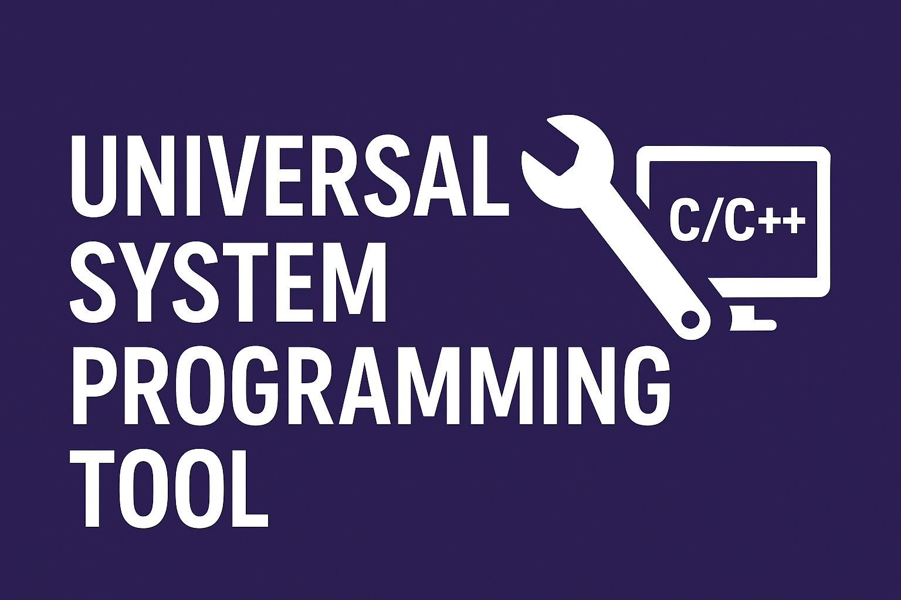
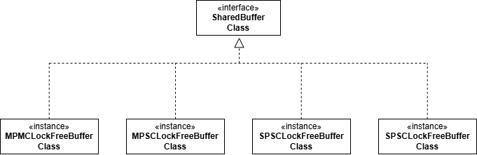
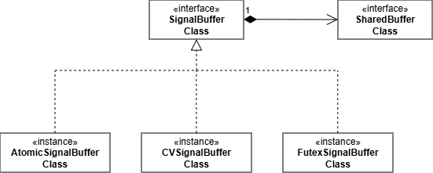
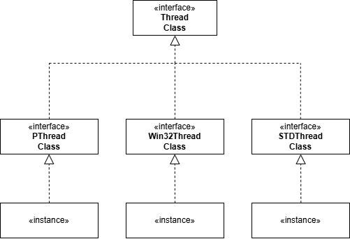

# Universal C/C++ System Programming Tool

**Universal C/C++ System Programming Tool** is a class creation project that can be applied universally to any type of system programming project.

## Prologue
When programming systems using OS resources, there are elements that, once implemented, can be reused whenever needed, regardless of the project type. Collecting these elements and modularizing them into a library allows for long-term reuse, regardless of project type. Furthermore, when utilizing a specific OS API, for example, multi-threading requires Linux's pthreads or Windows's Win32 Threads. However, when constructing objects using these APIs, common methods exist that can be implemented regardless of the OS type (such as checking if a thread is alive, reclaiming thread resources, and joining). (While the portable std::thread can be used, implementing systems requiring high precision and speed often necessitates using an OS-specific API rather than the C++ standard library.) For these objects, the Strategy design pattern can be used to implement an interface class and define pure virtual functions. The actual implementation can then be overridden by child classes (depending on the OS type) that inherit the interface.

The goal of this project is to modularize these common elements and, in OS-dependent cases, construct a higher-level interface to implement a library that allows common operations to be performed through the methods of the interface even in environments with different platforms.

## Environment

- Linux & Windows

## Key Features

# **Shared Buffer**  

A buffer class that allows data to be shared between multi thread

# **Signal Buffer**  

A buffer class that allows data to be sent and received via signals between multi thread

# **Thread**  

Thread object classes and thread pool classes available for multi thread programming

